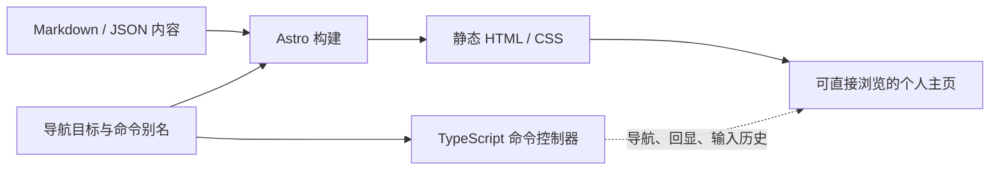

个人学术主页：前期调研与技术栈建议

调研日期：2026-09-25。状态：选型前调研，已由后续决策明确技术路线。

**当前已确认采用 Astro + TypeScript + xterm.js，见 [技术选型决策](../../docs/decisions/0001-tech-stack.md)。** 下文保留选型前的分析与建议；其中原生 DOM 终端的默认推荐及暂不采用 xterm.js 的建议已被该决策取代。具体交互与内容方案仍待后续 Spec 和 Design 确定。

Astro 与 Vite 两套方案的优缺点，以及 xterm.js 的独立取舍，见 [双方案对比](./tech-stack-options.md)。

**选型前曾建议采用 Astro 静态生成 + TypeScript + 原生 CSS + Markdown/结构化数据，通过 GitHub Actions 部署到 GitHub Pages。** 首版用语义化 HTML 展示个人信息，用一个小型命令控制器提供终端交互。先验证这一组合，再根据实际交互复杂度决定是否引入 React 等 UI 框架。

本次结论来自本地需求文档、参考站点的公开 HTML 与源码，以及各工具的官方文档。未搭建原型、安装依赖或做性能和设备实测；下述复杂度比较是针对本项目的工程判断，不是基准测试结果。

**项目现状决定了这次属于新项目选型。** 仓库目前只有 README、规则和设计意图、参考网站等文件，尚无应用源码、package.json、构建配置或现有测试。主要依据是 [项目设计意图](../../docs/intend.md)、[项目规则](../../AGENTS.md) 和 [参考网站](../../docs/refs/websites.md)。调研时规则引用的文件名与实际文件 docs/intend.md 不一致；后续导航整理已修正入口，原文件名称保留。

仓库尚未提供具体的交互 Spec、视觉 Design 或开发计划。以下涉及命令、页面结构和内容字段的内容都是建议，不能视为已经存在的产品要求。

| 已明确的需求 | 对技术选型的影响 |
| --- | --- |
| 学术信息展示优先，普通访客不必懂 Shell | 核心信息应直接生成到 HTML，并提供普通链接入口 |
| Terminal 是主要视觉与交互语言 | 用排版、提示符、颜色、命令输入体现风格；控制模拟范围 |
| 不实现完整 Shell、虚拟文件系统或真实命令执行 | 不需要终端后端、PTY、WebSocket 或 Shell 解析生态 |
| 轻量、快速、易维护 | 减少浏览器运行时依赖，让内容更新尽量不涉及组件代码 |
| 浏览、选择、复制、滚动和链接行为正常 | 优先使用浏览器原生的 DOM、输入框、锚点和链接 |
| GitHub Pages 部署 | 构建结果应是静态文件，线上不依赖常驻应用服务器 |

GitHub Pages 的定位是托管 HTML、CSS 和 JavaScript 等静态文件；它支持用 GitHub Actions 自定义构建。因此，选择 Astro、Vite 或 Next.js 的静态输出都可以部署，关键是所用功能不能依赖线上服务端运行时。[GitHub Pages 官方说明](https://docs.github.com/en/pages/getting-started-with-github-pages/what-is-github-pages)、[自定义构建流程](https://docs.github.com/en/pages/getting-started-with-github-pages/using-custom-workflows-with-github-pages)。

**参考主页值得借鉴的是内容组织和终端表达。** 蒋炎岩主页的 package.json 显示它采用 Vite、TypeScript、xterm.js 和 marked；README 描述了 Markdown 内容编译、命令注册和终端渲染等层次，并支持管道和 TUI 命令。它没有使用 React。[参考项目依赖](https://github.com/jiangyy/jiangyy.github.io/blob/main/package.json)、[参考项目架构](https://github.com/jiangyy/jiangyy.github.io)。

可借鉴的做法是把内容与交互分离，以及统一管理命令入口。本项目应把导航目标、名称和命令别名放在同一份定义中，供页面导航和命令控制器共用。这样添加一个内容栏目时不必同步维护两套入口。

需要调整的部分是参考项目较完整的 Shell/TUI 行为。其入口代码还包含终端获得焦点、处理浏览器历史，以及初始化后移除 URL hash 的逻辑。这些设计服务于它自己的体验；本项目建议保留可分享的定位链接，移动端由访客主动进入输入状态。[参考入口代码](https://github.com/jiangyy/jiangyy.github.io/blob/main/src/main.ts)。

在线页面的 HTML 也提供了 noscript 简介，因此不能把参考站点描述成完全没有禁用 JavaScript 时的内容。但本项目应进一步让介绍、代表工作和联系方式直接处于普通 HTML 内容流中，而不是只在备用简介里出现。[参考主页](https://jiangyy.github.io/)。

**候选方案的排序以本项目需求为依据。** 表中的 React 方案特指常见的 Vite 客户端渲染 SPA；React 本身也可以结合框架做静态生成。

| 方案 | 适合的部分 | 本项目需要承担的成本 | 建议 |
| --- | --- | --- | --- |
| Astro + TypeScript + 原生 CSS | 静态内容、组件复用、Markdown、局部交互 | 学习 Astro 模板、内容集合及构建与浏览器代码的边界 | 首选，兼顾首版和后续内容增长 |
| Vite + TypeScript + HTML/CSS | 固定的小型单页、少量 DOM 交互 | 内容增多后要自行组织模板、数据校验及静态页面生成 | 若确认长期只有少数栏目，可作为更简单的备选 |
| Vite + React + TypeScript | 多个相互关联的交互组件、复杂状态 | 常规 CSR 方案需要另做预渲染才能直接交付完整内容 HTML | 若熟悉 React 且交互明显复杂，再考虑；也可只给 Astro 添加一个 React 组件 |
| Next.js 静态导出 | 希望统一 React 技术栈、较多页面 | 需要约束功能使用范围；当前无需其服务端能力 | 可以部署，但不是当前首选 |
| Eleventy + 模板 + 少量脚本 | Markdown 和模板驱动的内容网站 | 需自行确定浏览器脚本处理和类型校验方案 | 若更偏好传统模板工作流，是合理替代 |

上述事实依据包括：Astro 可输出静态组件并按需加入交互；Vite 官方提供静态部署流程；React 官方说明从构建工具起步时需要自行选择应用基础设施；Eleventy 支持 Markdown 和多种模板。[Astro 渲染模型](https://docs.astro.build/en/concepts/islands/)、[Vite 静态部署](https://vite.dev/guide/static-deploy.html)、[React 从零搭建说明](https://react.dev/learn/build-a-react-app-from-scratch)、[Eleventy 文档](https://www.11ty.dev/docs/)。

Next.js 通过 output: 'export' 可以输出静态站点；需要请求时动态计算的能力、Server Actions、ISR 和默认图片优化等不适用于该模式。这里不推荐它，是因为本项目暂时用不到这些能力，并非 Next.js 不能部署到 Pages。[Next.js 静态导出边界](https://nextjs.org/docs/app/guides/static-exports)。

**首版技术栈建议如下。** 开发工具不等于交付给访客的 JavaScript；例如类型检查和浏览器测试仅在开发与 CI 中使用。

| 层次 | 建议 | 具体用途和边界 |
| --- | --- | --- |
| 页面与构建 | Astro，静态输出 | 构建时生成首页和需要的详情页；无需服务端适配器 |
| 语言 | TypeScript，strict 配置 | 内容类型、导航定义、命令与状态；配合 astro check |
| 终端交互 | Astro 组件中的原生脚本 + 独立 TS 模块 | 命令注册、输入处理、短回显和导航；首版无需 UI 框架 |
| 样式 | Astro 局部 CSS + 全局 CSS 变量 | 统一背景、文字、强调色、间距、边框和响应式规则 |
| 内容 | Markdown + Frontmatter；简单资料用一个 JSON 文件 | 项目与论文可使用 Astro Content Collections 做构建时校验 |
| 工具链 | Astro 支持的维护中 Node.js LTS + npm | 提交 package-lock.json；CI 使用 npm ci；Node 只用于开发与构建 |
| 代码质量 | astro check + Prettier；配置匹配 Astro/TS 的 ESLint | 类型、格式和常见错误检查，分别设职责 |
| 测试 | Playwright；出现命令解析/历史逻辑后配 Vitest | 验证关键用户路径和有分支的纯逻辑，避免为静态文案堆测试 |
| 发布 | GitHub Actions → GitHub Pages | 检查后构建并发布 dist 静态产物 |

Astro 自带脚本打包与 TypeScript 支持，足以实现输入框、事件监听和 DOM 更新；不需要为了命令栏先安装 React。它也支持组件局部 CSS，适合本项目少量自定义组件。[脚本处理](https://docs.astro.build/en/guides/client-side-scripts/)、[样式机制](https://docs.astro.build/en/guides/styling/)。

Content Collections 可以为同类条目定义字段与校验规则。本项目建议只使用构建时集合：项目可包含 title、summary、date、tags、links；论文可包含 title、authors、year、venue、doi、links。具体必填字段应由真实内容样本决定。正文使用 Markdown；只有出现文章内嵌交互组件的明确需求时才增加 MDX。[内容集合](https://docs.astro.build/en/guides/content-collections/)。

版本策略是在初始化时核验稳定版与 Node 兼容范围，记录 Node 和依赖版本，并提交锁文件。本调研不把参考项目的依赖版本直接当作新项目模板，也不把可变的 latest 当作 CI 的可复现配置。[Astro 安装要求](https://docs.astro.build/en/install-and-setup/)。

**推荐的页面结构是静态内容加交互增强。** 首屏显示姓名、研究方向和代表工作入口；介绍、项目、论文和联系方式均可通过正常浏览访问。终端提示符和输入栏提供另一种导航方式。栏目命令首版以定位内容为主，回显命令和简短结果，不重复塞入整篇论文或项目介绍。

例如，点击“论文”链接和输入 papers 都应到达 #papers；项目详情需要独立分享时，再生成 /projects/项目标识/ 这样的真实静态页面。首版的单页锚点和后续静态详情页都能保留刷新、复制链接和浏览器前进后退行为，无需先引入客户端路由。

| 建议首版命令 | 建议行为 |
| --- | --- |
| help | 列出可用命令，并提供可点击入口 |
| about / projects / papers / contact | 定位相应内容区域，保持可分享 URL |
| clear | 仅清理命令回显区域，保留主页内容 |
| 未知命令 | 显示短提示和 help 入口；输入按文本渲染 |

输入历史可先保存在内存，不必持久化。命令只触发预定义的前端操作。首版无需解释管道、重定向、任意路径或执行用户输入的代码。

**选型前暂不采用 xterm.js 的建议已被确认采用 xterm.js 的决策取代。** 以下为当时的分析： 它是浏览器终端组件，适合需要终端控制序列和屏幕行为的场景。本项目采用 HTML 输入框、链接和内容块即可表达终端风格，能减少把学术内容转成终端输出再维护其网页行为的工作。这个判断不等于 xterm.js 没有链接或可访问性支持，也不意味着使用它就会执行真实 Shell。[xterm.js 官方介绍](https://xtermjs.org/)。

样式方面建议先建立少量 CSS 变量和组件规则。Tailwind 可以作为个人开发偏好，但当前没有证据表明需要为这些组件增加另一层样式约定。配色、等宽提示符、克制的光标效果和信息层次应先确定；长篇内容应以可读性为准，不能依赖字符格对齐。大动画库、全局状态库和后端服务暂时没有对应需求。

**移动端和浏览器行为需要在原型阶段验证。** 输入使用带标签的原生 input，移动端不自动抢焦点，提供可点的栏目入口和提交按钮。保留普通 Tab 焦点导航；若以后增加命令补全，再设计明确且可退出的操作方式。

处理 Enter 提交和历史切换时，需要考虑中文输入法的组合输入状态，避免用户确认候选词时执行命令；可使用 composition 事件和 KeyboardEvent.isComposing，并在真实设备验证。动画应响应 prefers-reduced-motion。[输入组合状态](https://developer.mozilla.org/en-US/docs/Web/API/KeyboardEvent/isComposing)、[减少动画偏好](https://developer.mozilla.org/en-US/docs/Web/CSS/Reference/At-rules/@media/prefers-reduced-motion)。

桌面端和移动端都应使用正常页面滚动；长标题、链接和中文内容允许换行。论文链接使用 a，操作使用 button，动态提示仅播报简短状态。初始 HTML 包含主要内容、合理的标题层级与页面元信息，可以降低搜索和链接预览对 JavaScript 执行的依赖；这不保证搜索排名。

**部署建议使用 GitHub Actions 发布构建产物。** 结合当前仓库名称，若 GitHub 所有者确为 zhu-chen 且使用默认个人站域名，则 Astro 的 site 为 https://zhu-chen.github.io，base 保持根路径。若实际仓库归属或域名不同，按真实地址设置。个人站仓库不应误把 base 设成 /zhu-chen.github.io/。[Astro 的 GitHub Pages 部署说明](https://docs.astro.build/en/guides/deploy/github/)。

CI 应依次完成可复现安装、检查、测试和静态构建，并让浏览器测试访问构建产物。PR 执行验证，发布分支通过验证后部署；源代码和发布产物无需在同一分支手工混排。内容更新经构建后上线，符合个人主页的维护频率。[GitHub Actions 发布配置](https://docs.github.com/en/pages/getting-started-with-github-pages/configuring-a-publishing-source-for-your-github-pages-site)。

**验证范围应对应真实使用风险。** Astro 的构建命令不代替完整类型检查，应单独执行 astro check；官方文档也给出了 Vitest 和 Playwright 的接入方式。[类型检查](https://docs.astro.build/en/guides/typescript/)、[测试集成](https://docs.astro.build/en/guides/testing/)。

| 验证项 | 首版验收建议 |
| --- | --- |
| 构建与内容 | 类型、Lint、构建通过；字段错误能在构建阶段暴露 |
| 基本访问 | 禁用 JavaScript 仍可查看介绍、代表工作和联系方式，链接可用 |
| 命令 | 正常、空白、未知输入及输入历史正常；clear 不清掉主页内容 |
| 导航 | 点击和命令到达同一目标；复制链接、刷新、前进后退正确 |
| 键盘与输入法 | Tab 可离开输入区；选词确认不误提交；选择与复制不受干扰 |
| 桌面与移动 | 至少检查 360px、390px 和桌面宽度；无页面级意外横向溢出 |
| 运行时 | 无新增控制台错误；脚本失败时核心内容仍可访问 |
| 加载 | 记录初始 JS、图片、字体体积和移动端加载表现，再确定性能预算 |

Playwright 设备模拟适合视口与浏览器行为回归；软键盘、中文输入法和触摸体验仍需手机实测。本轮未执行这些验证，不提供虚构的包体积、Lighthouse 分数或设备兼容结论。[Playwright 设备模拟](https://playwright.dev/docs/emulation)。

**建议按三个阶段推进。** 每阶段应产生可查看的结果，再决定是否增加复杂度。

1. 补齐最小 Spec 和 Design：确认首屏信息、栏目、命令范围、普通导航、移动端输入和少量样式变量；用真实简介、一个项目和一篇论文作为内容样本。
2. 做一个可部署的 Astro 原型：首页静态内容、一个命令输入框、栏目导航、共享入口定义和 Pages 构建流程；先验证禁用 JavaScript、手机浏览及深链接。
3. 按验证结果扩展：增加完整论文/项目集合与详情页；在命令逻辑出现分支时补单元测试，将关键路径纳入 Playwright，再调加载体积和细节。

只有出现以下变化才值得重新选型：长期固定的极小单页可改选 Vite + 原生 TS；命令区出现较复杂的状态与组件协作时可给 Astro 加一个 React island；出现登录、个性化或服务端写入需求时再重新评估托管与后端。当前文档没有要求这些能力，首版无需提前建设。
